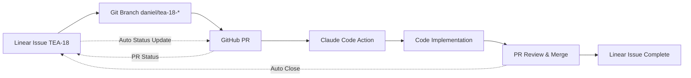

# Linear Integration Test Documentation

## TEA-18: Test Linear Issue Status Sync with GitHub

### Purpose
This document serves as a test artifact for validating the Linear ↔ GitHub integration workflow.

**Linear Issue**: [TEA-18: Test Linear issue status sync with GitHub](https://linear.app/team-aimo/issue/TEA-18/test-linear-issue-status-sync-with-github)

### Test Scenarios

#### 1. Branch Creation
- [x] Created branch: `daniel/tea-18-test-linear-issue-status-sync-with-github`
- [x] Branch name follows Linear's suggested convention
- [ ] Linear issue status should update to "In Progress"

#### 2. Commit Linking
- [ ] Commits with TEA-18 prefix should link to Linear issue
- [ ] Linear should show commit history
- [ ] GitHub should reference Linear issue

#### 3. PR Creation and Linking
- [ ] PR title includes TEA-18 for automatic linking
- [ ] PR description references Linear issue URL
- [ ] Linear should show PR status
- [ ] GitHub should link back to Linear

#### 4. Claude Code Integration
- [ ] @claude mentions in PR comments should trigger GitHub Action
- [ ] Claude should have context of Linear issue requirements
- [ ] Claude responses should reference TEA-18 when appropriate

#### 5. Status Synchronization
- [ ] PR draft → Linear issue remains "In Progress"
- [ ] PR ready for review → Linear issue status updates
- [ ] PR merged → Linear issue moves to "Done"
- [ ] PR closed without merge → Linear issue reverts appropriately

### Integration Validation Checklist

**Linear Project Created**: ✅
- Project: "Claude Code Integration Demo"
- URL: https://linear.app/team-aimo/project/claude-code-integration-demo-46d6fa2effa5

**Linear Issue Created**: ✅
- Issue: TEA-18
- Title: "Test Linear issue status sync with GitHub"
- Status: Todo
- URL: https://linear.app/team-aimo/issue/TEA-18/test-linear-issue-status-sync-with-github

**GitHub Integration**: 🔄
- Branch: daniel/tea-18-test-linear-issue-status-sync-with-github
- Commits: TEA-18 prefixed
- PR: To be created with Linear linking

### Expected Integration Points

### Success Criteria
- Seamless workflow from Linear planning to GitHub execution
- Automatic status synchronization in both directions
- Claude Code Action integration with Linear context
- Clean audit trail of work across both platforms

### Notes
This is a test implementation - no functional code changes are required.
Focus is on validating the integration workflow and automation.

---
Created for Linear issue: TEA-18
Project: Claude Code Integration Demo
Branch: daniel/tea-18-test-linear-issue-status-sync-with-github